### Learn-Airflow(Data-Pipeline-with-Airflow)
Data Pipeline with Airflow project using MinIO and Postgresql.

this project is refrence by github https://github.com/akarce/Udacity-Data-Pipeline-with-Airflow.git
## Project Structure:

+ dags: Directory containing Airflow DAG scripts.
    + create_tables_and_buckets.py: DAG for creating tables on PostgreSQL and buckets on MinIO.
    + create_tables.sql: SQL script containing CREATE TABLE queries.
    + pipeline_dag.py: Main DAG script for the ETL data pipeline.

+ data: Directory for storing project source data.
    + log_data: Subdirectory for log data.
    + song_data: Subdirectory for song data.

+ plugins: Directory for custom Airflow plugins.
    + operators: Subdirectory for operator scripts.
        + init.py: Initialization script for operators.
        + stage_postgresql_operator.py: Operator script for copying data from MinIO to PostgreSQL.
        + load_fact_operator.py: Operator script for executing INSERT queries into the fact table.
        + load_dimension_operator.py: Operator script for executing INSERT queries into dimension tables.
        + data_quality_operator.py: Operator script for performing data quality checks.

    + helpers: Subdirectory for helper scripts.
        + __init__.py: Initialization script for helpers.
        + sql_queries.py: Script containing SQL queries for building dimensional tables.

### Airflow Dag Overview

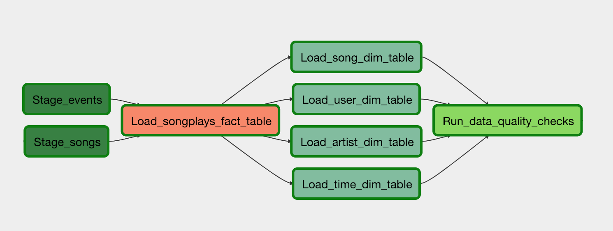

### Staging & Fact Table Schema

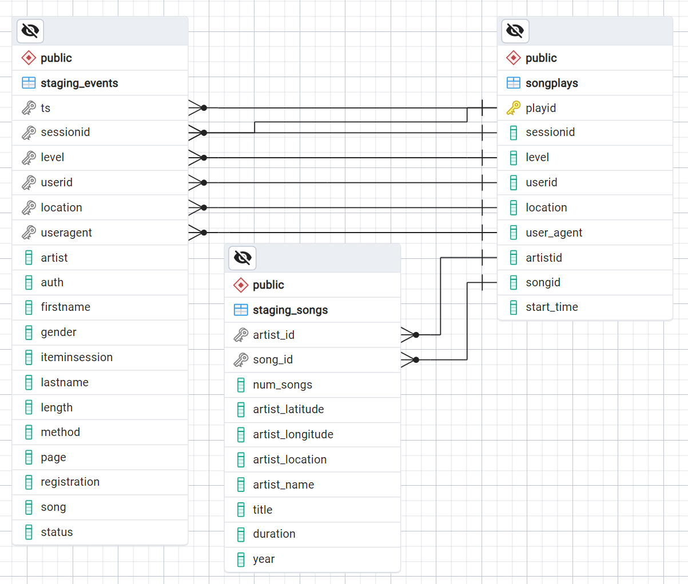

### Dimension Tables Schema

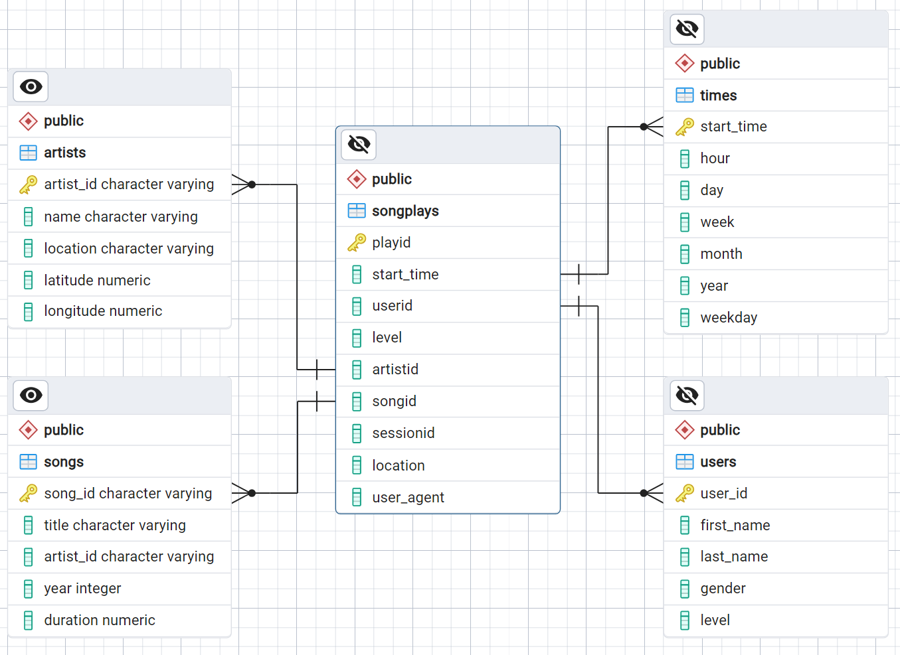

# How to Run

### Change directory

`$ cd Data-pipline-airflow`

## Build the docker images with docker compose:

`$ docker compose up -d`

### WebUI links: \
`Airflow webserver` http://localhost:8080/

`MinIO` http://localhost:9001/

### Sign in to Airflow webserver:

`Username:` airflow 
`Password:` airflow

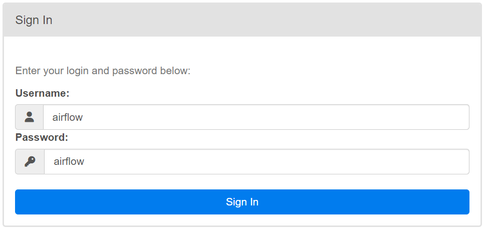

### Create Postgres connection:

#### Go to admin -> Connections -> Add a new record

Connection Id: postgres_conn \
Connection Type: Postgres \
Host: host.docker.internal \
Database: sparkifydb \
Login: postgres_user \
Password: postgres_password \
Port: 5432

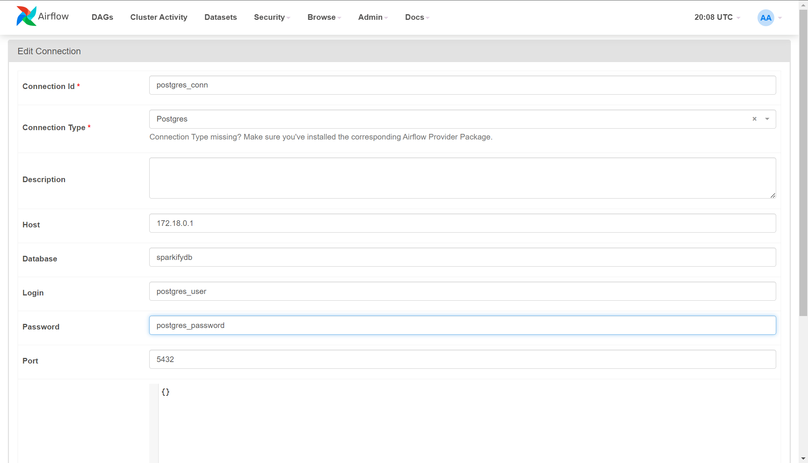

### Obtain Access Key from MinIO:

Go to MinIO WebUI using http://localhost:9001/ \
From Access Keys section -> create access key -> Create \
Store you Access Key and Secret Key using Download for Import

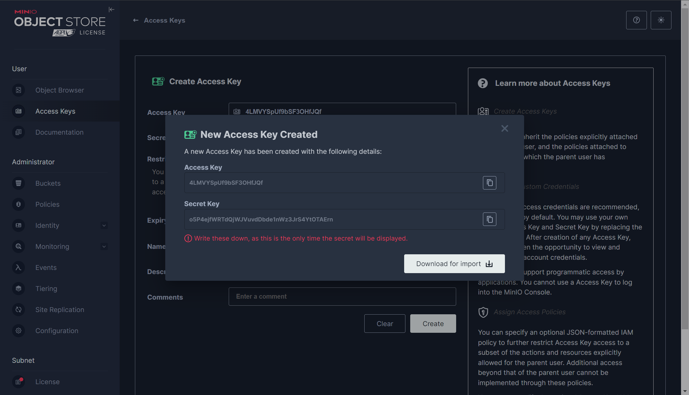

### Create MinIo connection:

#### Go to admin -> Connections -> Add a new record

Connection Id: minio_conn \
Connection Type: Amazon Web Services \
AWS Access Key ID: <your_key_id> \
AWS Secret Access Key: <your_secret_key> \

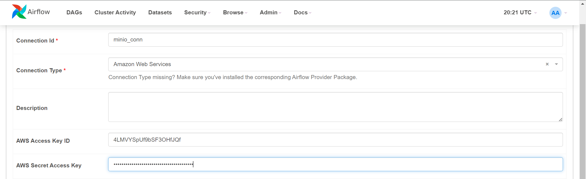

### Trigger the create_tables_and_buckets_dag using Airflow WebUI

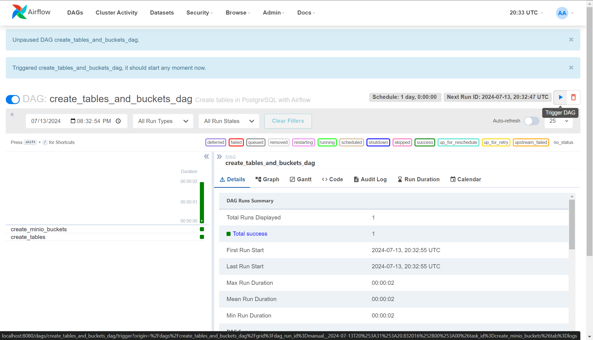

This will create two buckets named \
    udacity-dend, processed \
and 7 postgres tables named \
    artists, songplays, songs, staging_events, staging_songs, times, users

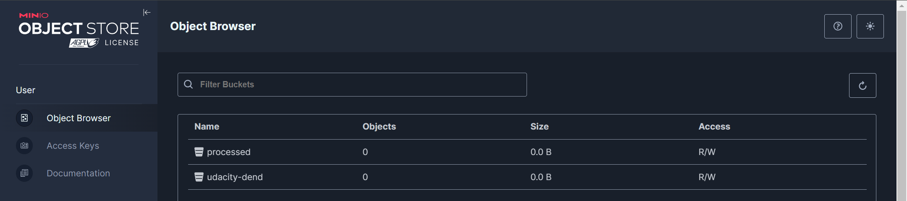

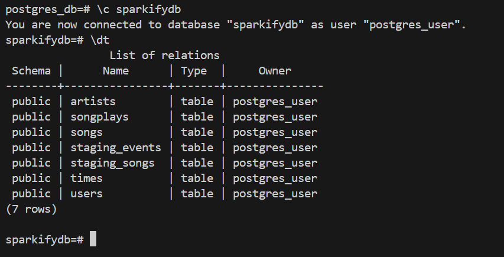

### To see the schemas of tables use \
`$ \d <table_name>`

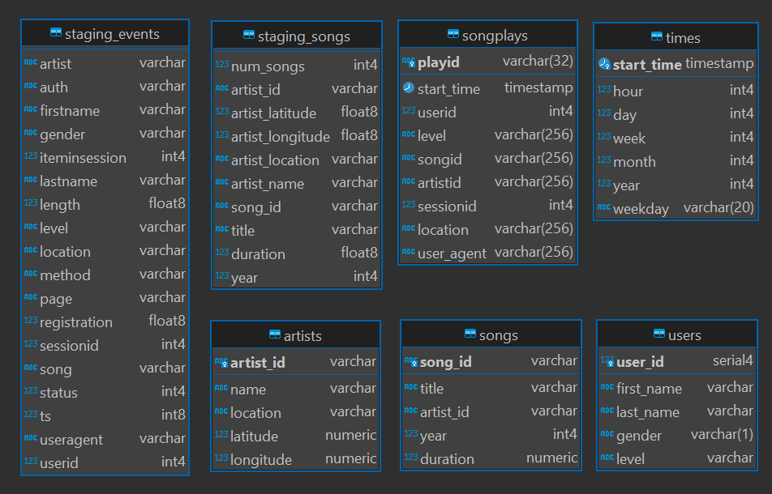

### Upload the log_data and song_data folders from data folder into udacity-dend bucket from MinIO WebUI

`Username:` minioadmin \
`Password:` minioadmin

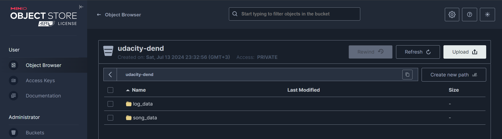

### Finally unpause the dag named pipeline:

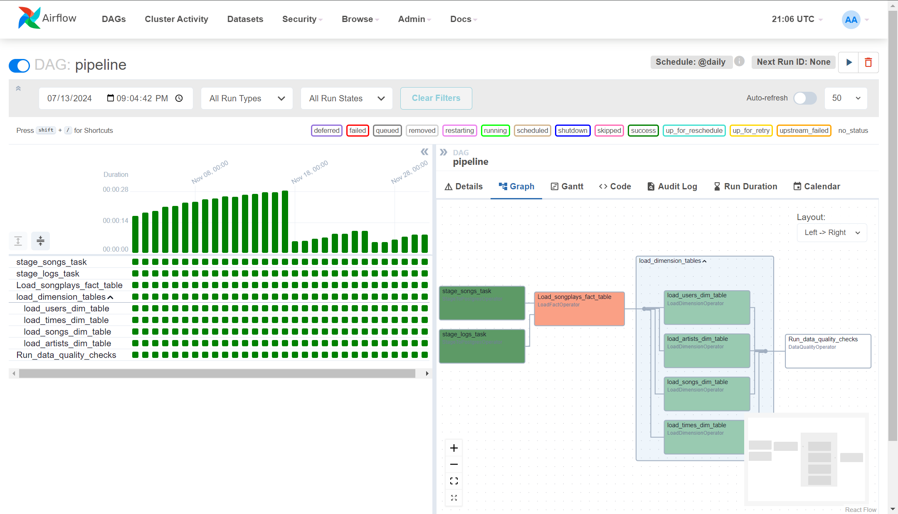

#### After finished successfully you can check the logs for data quality messages, and the all objects will be moved to the processed bucket.

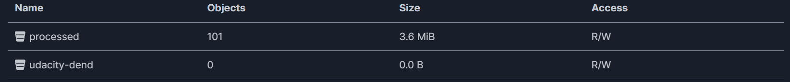

#### You can see the Airflow logs for data quality results:

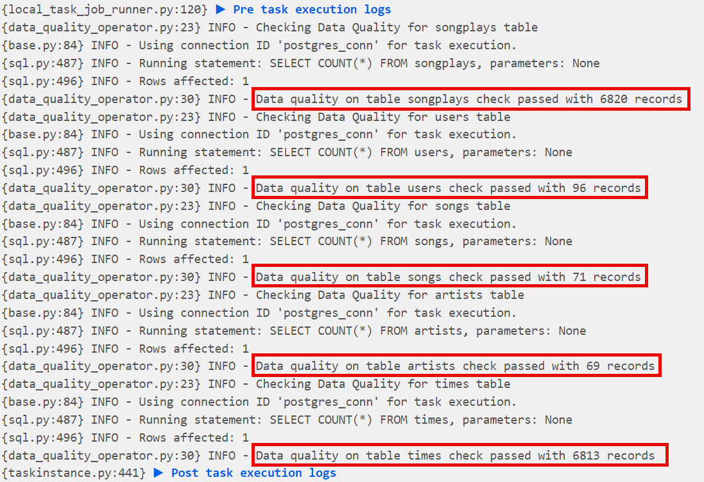

=======

### Staging & Fact Table Schema

### Dimension Tables Schema

# How to Run

## Clone the project repository

`$ git clone https://github.com/xRayzox/Data-Pipeline-Airflow-Learn.git`